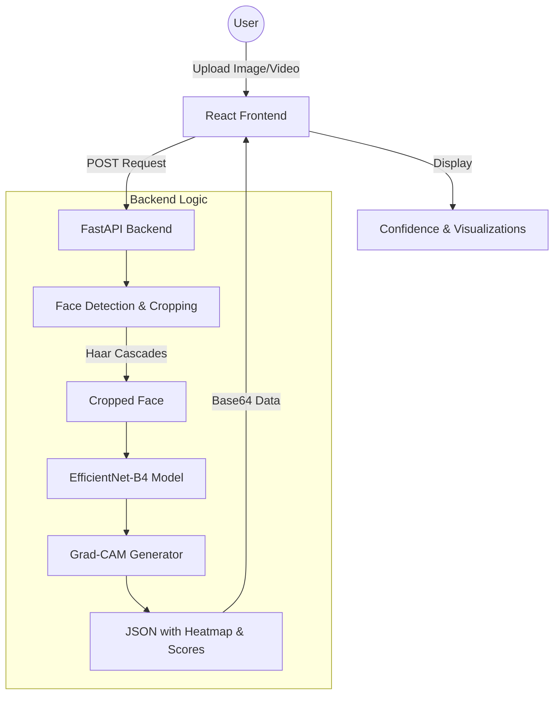

# DeepFake Detector

A full-stack application designed to detect deepfake images and videos using state-of-the-art Deep Learning techniques. 
## Features

- **Image Detection**: Upload images to detect face manipulations with high confidence.
- **Video Analysis**: Analyze video segments frame-by-frame with per-frame scoring and overall verdict.
- **Explainable AI (XAI)**: Visualizes model focus using Grad-CAM heatmaps, showing exactly which parts of the face look "fake".
- **Real-time Processing**: Fast inference using an optimized FastAPI backend.
- **Modern UI**: Clean and responsive React-based interface for seamless user experience.

---

## 🛠️ Tech Stack

### Frontend
- **Framework**: [React.js](https://reactjs.org/) (Vite)
- **Styling**: Vanilla CSS3
- **File Handling**: [react-dropzone](https://react-dropzone.js.org/)
- **Networking**: [Axios](https://axios-http.com/)

### Backend
- **Framework**: [FastAPI](https://fastapi.tiangolo.com/)
- **Server**: [Uvicorn](https://www.uvicorn.org/)
- **Deep Learning**: [PyTorch](https://pytorch.org/)
- **Computer Vision**: [OpenCV](https://opencv.org/)
- **Pre-trained Model**: EfficientNet-B4 (via `efficientnet_pytorch`)

---

## 🏗️ Architecture

The system follows a classic Client-Server architecture with a focus on high-performance deep learning inference:



### 1. Data Preprocessing
- Images and video frames are converted to grayscale for face detection.
- **Haar Cascades** (OpenCV) identify the largest face in the frame.
- Faces are cropped with a 20% margin to ensure context around the facial features is captured.

### 2. Model Architecture
- **Backbone**: EfficientNet-B4, known for its efficiency and accuracy in image classification tasks.
- **Custom Head**: A sequential layer consisting of Dropout, Linear (512 units), ReLU, and a final classification layer for Binary Classification (Real vs. Fake).

### 3. Grad-CAM (XAI)
- Gradient-weighted Class Activation Mapping is used to generate heatmaps.
- It highlights the specific facial regions (eyes, mouth, skin textures) that the model identified as suspicious or manipulated.

---


## ⚙️ Installation & Setup

### Backend
1. Navigate to the root directory.
2. Install dependencies:
   ```bash
   pip install -r requirements.txt
   ```
3. Run the server:
   ```bash
   python backend/main.py
   ```

### Frontend
1. Navigate to the `frontend` folder.
2. Install dependencies:
   ```bash
   npm install
   ```
3. Run the development server:
   ```bash
   npm run dev
   ```

---

## 📊 Dataset & Training
The 140k Real and Fake Faces dataset from Kaggle is used for training.
